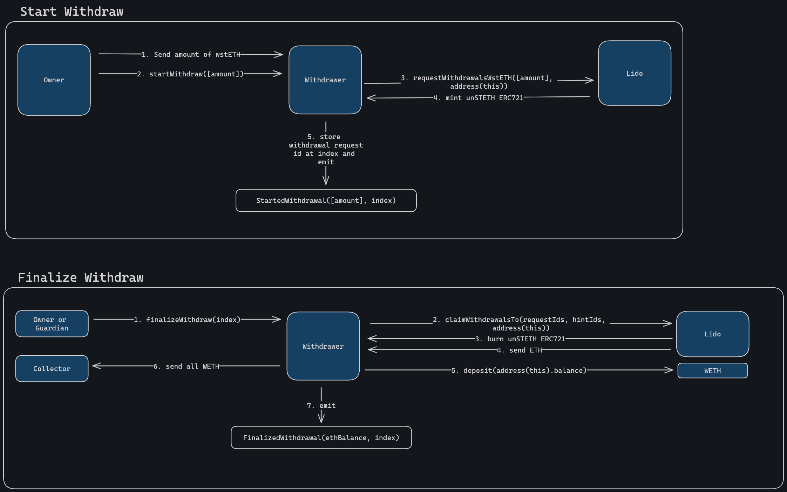

# Strategic Assets Manager Information

## Main Idea

The main idea of this new contract is for the DAO to be able to handle strategic assets (assets that will earn rewards, or assets that can be used to
vote on different protocols, for example) without the need to go through the full governance flow every week.

Take the following example: the DAO wants to hold veBAL as part of its strategy for the long term. To get the most out of veBAL, the DAO should "re-lock"
its holdings on a weekly basis. This is a very tedious approach and can lead to a lot of voter fatigue. Because of this, the StrategicAssetsManager contract
can be governed by the DAO, while some functions can be invoked by an allowed guardian, acting on the role of Asset Manager.

## Functionality

#### StrategicAssetsManager.sol

`function withdrawERC20(address token, address to, uint256 amount) external onlyOwner`

Sends ERC20 tokens to an address. Withdrawal mechanism.

`function updateGuardian(address _manager) external onlyOwner`

Updates guardian role, which in this contract functions as a strategic asset manager. Inherited from OwnableWithGuardian.

`function transferOwnership(address _owner) external onlyOwner`

Updates the owner of the contract. Inherited from Ownable.

#### VeTokenManager.sol

```
 function buyBoost(
    address underlying,
    address delegator,
    address receiver,
    uint256 amount,
    uint256 duration
  ) external onlyOwnerOrGuardian
```

Purchase boost to incentivize rewards earned by locking (up to 2.5x of earnings). Spend fee token.
For more info see: https://doc.paladin.vote/warden-boost/boost-market

The idea is to increase the yield in the provided liquidity.
For example, pay 10 BAL to boost rewards in a veBAL pool up to 2.5x times, to earn more BAL in return.

```
 function sellBoost(
    address underlying,
    uint256 pricePerVote,
    uint64 maxDuration,
    uint64 expiryTime,
    uint16 minPerc,
    uint16 maxPerc,
    bool useAdvicePrice
  ) external onlyOwnerOrGuardian
```

Owner of veToken allows others to incentivize their liquidity pools by selling boost. The price can be chosen by the user, or by setting useAdvicePrice, let Warden determine the price.
The seller of boost receives the native token.

```
  function updateBoostOffer(
    address underlying,
    uint256 pricePerVote,
    uint64 maxDuration,
    uint64 expiryTime,
    uint16 minPerc,
    uint16 maxPerc,
    bool useAdvicePrice
  ) external onlyOwnerOrGuardian
```

Allows the user to update an existing offer to sell boost.

`function removeBoostOffer(address underlying) external onlyOwnerOrGuardian`

Removes a boost offer.

` function claimBoostRewards(address underlying) external onlyOwnerOrGuardian`

Claim rewards earned by selling boost.

`function setSpaceIdVEBAL(address underlying, bytes32 _spaceId) external onlyOwnerOrGuardian`

Sets the spaceID that's used by protocol on Snapshot for voting. For example, "balancer.eth" is Balancer's spaceId on Snapshot.

```
 function setDelegateVEBAL(
    address underlying,
    address newDelegate
  ) external onlyOwnerOrGuardian
```

Delegate tokens so they can vote on Snapshot.

`function clearDelegateVEBAL(address underlying) external onlyOwnerOrGuardian`

Remove the active delegate.

```
function setLockDurationVEBAL(
    address underlying,
    uint256 newLockDuration
  ) external onlyOwnerOrGuardian
```

Set the lock duration to specific time. For example, max lock for veBAL is 1 year, so set to 1 year (or less).

`function lockVEBAL(address underlying) external onlyOwnerOrGuardian`

The main function for veBAL.
Initially, it locks the B-80BAL-20WETH token to receive veBAL. (This contract needs to be allow-listed by Balancer prior to calling or it will fail).
On subsequent calls (for example, weekly) it extends the lock duration once again. The voting % available per token is dependent on the locking duration.
If locking duration is 6 months and the maximum duration is 1 year, then the voting weight is only half.
This function also locks more of the native token held by StrategicAssetsManager available on the contract.

`function unlockVEBAL(address underlying) external onlyOwnerOrGuardian`

Unlocks the veToken in order to receive the underlying once again. Lock duration needs to have passed or transaction will revert.

#### VlTokenManager.sol

`function lockVLAURA(uint256 amount) external onlyOwnerOrGuardian`

Locks AURA into vlAURA (if not locked before).

`function claimVLAURARewards() external onlyOwnerOrGuardian`

Claims rewards accrued by locking vlAURA.

`function delegateVLAURA(address delegatee) external onlyOwnerOrGuardian`

Delegates vlAURA for voting purposes.

`function relockVLAURA() external onlyOwnerOrGuardian`

Relocks vlAURA that has been previously locked.

`function unlockVLAURA() external onlyOwnerOrGuardian`

Unlock vlAURA position into AURA. Lock period needs to have passed or it will revert.

`function emergencyWithdrawVLAURA() external onlyOwnerOrGuardian`

Emergency function to exit a position if the AURA system is shut down.

##### LSDLiquidityGaugeManager.sol

`function setGaugeController(address token, address gaugeController) public onlyOwnerOrGuardian`

Sets the address that handles gauges for veTokens.

Here is the proposal on Balancer as it relates to GHO: https://forum.balancer.fi/t/bip-xxx-approve-the-smbpt-gauges-for-the-aave-sm/4949
This post has the explanation on all the steps the DAO can expect to interact with these protocols to maximize rewards.
The excalidraw towards the bottom of the page is helpful in seeing the full flow.

Curve docs on liquidity gauges: https://curve.readthedocs.io/dao-gauges.html

The main concept here is that the ecosystem rewards liquidity providers by rewarding them with token emissions. These tokens are distributed according to which gauges receive the
most votes.

```
function voteForGaugeWeight(
    address token,
    address gauge,
    uint256 weight
  ) external onlyOwnerOrGuardian
```

Utilizing the veToken holdings, the DAO can vote to redirect emissions to the DAO's own gauge.
Here, by voting for the DAO's gauge, and also purchasing boost, the DAO can expect to earn a lot more BAL rewards over time than just by holding a veToken for example.

# Aave wstETH Withdrawer Information

This contract allows the Aave DAO to easily withdraw wstETH back to ETH natively.



## Usage

To use it, you need to (1) transfer an `amount` of `wstETH` to the `Withdrawer`, (2) note the `index` returned by `nextIndex()`, (3) call `startWithdraw([amount])`, and after waiting <24h, (4) call `finalizeWithdraw(index)` to collect the ETH, deposit it into WETH, and send it to the Aave DAO Collector.

### AaveWstethWithdrawer is deployed at eth:[0x2C4d3C146b002079949d7EecD07f261A39c98c4d](https://etherscan.io/address/0x2C4d3C146b002079949d7EecD07f261A39c98c4d)

### Notes

The function `startWithdraw(uint256[] amounts)` takes in an array of `amounts` due to Lido limitations. Each `amount` in the array must be at least 100 wei and at most 1000 stETH. For withdrawals larger than 1000 stETH, they need to be split into multiple withdrawal requests.

For example, if we're trying to withdraw 1500 stETH, we would execute the following call: `startWithdraw([750e18, 750e18])`.

The function `startWithdraw(uint256[] amounts)` can only be called by the owner.
The function `finalizeWithdraw(index)` can only be called by the owner or the guardian.