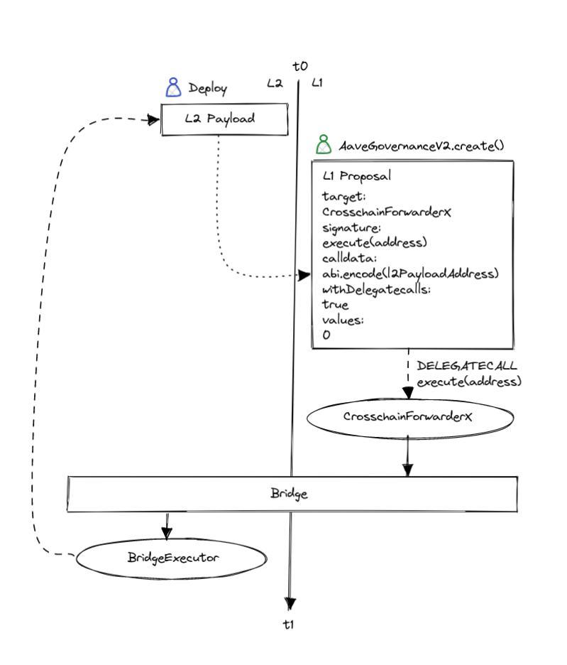

# CrosschainForwarder

## About

To simplify the process of creating a cross-chain proposal this repository contains opinionated `CrosschainForwarder` contracts for `Polygon`, `Optimism`, `Metis` and `Arbitrum` abstracting away the complexity of bridging & cross-chain gas calculations.
All the forwarders follow the same pattern. They expect a payload to be deployed on L2 and to be executed with a parameterless `execute()` signature and via `DELEGATECALL`.

### Polygon

For a proposal to be executed on Polygon it needs to pass a mainnet governance proposal that sends an encoded payload via `sendMessageToChild(address,bytes)` on [FX_ROOT](https://etherscan.io/address/0xfe5e5D361b2ad62c541bAb87C45a0B9B018389a2#code)(mainnet) to [FX_CHILD](https://polygonscan.com/address/0x8397259c983751DAf40400790063935a11afa28a#code)(Polygon).
Once the state is synced to `FX_CHILD` on Polygon network it will queue the payload on [POLYGON_BRIDGE_EXECUTOR](https://polygonscan.com/address/0xdc9A35B16DB4e126cFeDC41322b3a36454B1F772#code).

### Optimism

For a proposal to be executed on Optimism it needs to pass a mainnet governance proposal that sends an encoded payload via `sendMessage(address,bytes,uint32)` on [L1_CROSS_DOMAIN_MESSENGER](https://etherscan.io/address/0x25ace71c97B33Cc4729CF772ae268934F7ab5fA1)(mainnet) to [L2_CROSS_DOMAIN_MESSENGER](https://optimistic.etherscan.io/address/0x4200000000000000000000000000000000000007#code)(Optimism).
Once the state is `L2_CROSS_DOMAIN_MESSENGER` on Optimism it will queue the payload on [OPTIMISM_BRIDGE_EXECUTOR](https://optimistic.etherscan.io/address/0x7d9103572bE58FfE99dc390E8246f02dcAe6f611).

### Metis

Similar to Optimism, for a proposal to be executed on Metis it needs to pass a mainnet governance proposal that sends an encoded payload via `sendMessage(address,bytes,uint32)` on [L1_CROSS_DOMAIN_MESSENGER](https://etherscan.io/address/0x081D1101855bD523bA69A9794e0217F0DB6323ff)(mainnet) to [L2_CROSS_DOMAIN_MESSENGER](https://andromeda-explorer.metis.io/address/0x4200000000000000000000000000000000000007)(Metis).
Once the state is `L2_CROSS_DOMAIN_MESSENGER` on Metis it will queue the payload on [METIS_BRIDGE_EXECUTOR](https://andromeda-explorer.metis.io/address/0x8EC77963068474a45016938Deb95E603Ca82a029).

Caveat: Opposed to the other messenger like on Optimism, using the Metis messenger requires a whitelist by the Metis team. The [SHORT_EXECUTOR](https://etherscan.io/address/0xEE56e2B3D491590B5b31738cC34d5232F378a8D5) has been whitelisted to use the messenger. Also, the gas to queue the payload by the messenger has been hardcoded to 5 million, which seems reasonable considering the queue transaction. Unlike Optimism, the Metis messenger has no limit on gas, and everything is prepaid.

### Arbitrum

For a proposal to be executed on Arbitrum it needs to pass a mainnet governance proposal that sends an encoded payload via `unsafeCreateRetryableTicket{value: uint256}(address,uint256,uint256,address,address,uint256,uint256,bytes)` on [INBOX](https://etherscan.io/address/0x4Dbd4fc535Ac27206064B68FfCf827b0A60BAB3f)(mainnet). The Arbitrum bridge will then call the bridged calldata via the L2_ALIAS of the mainnet `msg.sender` (in this case is the aliased mainnet governance executor) which will queue the payload on [ARBITRUM_BRIDGE_EXECUTOR](https://arbiscan.io/address/0x7d9103572bE58FfE99dc390E8246f02dcAe6f611).

Caveat: Opposed to the other bridges, Arbitrum inbox bridge requires you to supply some gas.
For simplicity the `CrosschainForwarderArbitrum` expects some eth to be available on the [SHORT_EXECUTOR](https://etherscan.io/address/0xEE56e2B3D491590B5b31738cC34d5232F378a8D5).
You can check if you need to top-up the SHORT_EXECUTOR by calling `getRequiredGas(580)` on the `CrosschainForwarderArbitrum`.

## Deployed addresses

### Forwarders

- [CrosschainForwarderPolygon](https://etherscan.io/address/0x158a6bc04f0828318821bae797f50b0a1299d45b#code)
- [CrosschainForwarderOptimism](https://etherscan.io/address/0x5f5c02875a8e9b5a26fbd09040abcfdeb2aa6711#code)
- [CrosschainForwarderMetis](https://etherscan.io/address/0x2fE52eF191F0BE1D98459BdaD2F1d3160336C08f#code)
- [CrosschainForwarderArbitrum](https://etherscan.io/address/0x2e2B1F112C4D79A9D22464F0D345dE9b792705f1#code)

## References

- [PolygonBridge: FxRoot](https://etherscan.io/address/0xfe5e5d361b2ad62c541bab87c45a0b9b018389a2#code)
- [PolygonBridge: PolygonBridgeExecutor](https://polygonscan.com/address/0xdc9A35B16DB4e126cFeDC41322b3a36454B1F772#code)

- [OptimismBridge: L1CrossDomainMessenger](https://etherscan.io/address/0x25ace71c97b33cc4729cf772ae268934f7ab5fa1#readProxyContract)
- [OptimismBridge: OptimismBridgeExecutor](https://optimistic.etherscan.io/address/0x7d9103572be58ffe99dc390e8246f02dcae6f611#code)

- [MetisBridge: L1CrossDomainMessenger](https://etherscan.io/address/0x081D1101855bD523bA69A9794e0217F0DB6323ff#code)
- [MetisBridge: MetisBridgeExecutor](https://andromeda-explorer.metis.io/address/0x8EC77963068474a45016938Deb95E603Ca82a029/contracts#address-tabs)

- [ArbitrumBridge: Inbox](https://etherscan.io/address/0x4dbd4fc535ac27206064b68ffcf827b0a60bab3f#code)
- [ArtitrumBridge: ArbitrumBridgeExecutor](https://arbiscan.io/address/0x7d9103572be58ffe99dc390e8246f02dcae6f611#code)

- [aave crosschain-bridge repository](https://github.com/aave/governance-crosschain-bridges#polygon-governance-bridge)
- [first ever Polygon bridge proposal](https://github.com/pakim249CAL/Polygon-Asset-Deployment-Generic-Executor)
